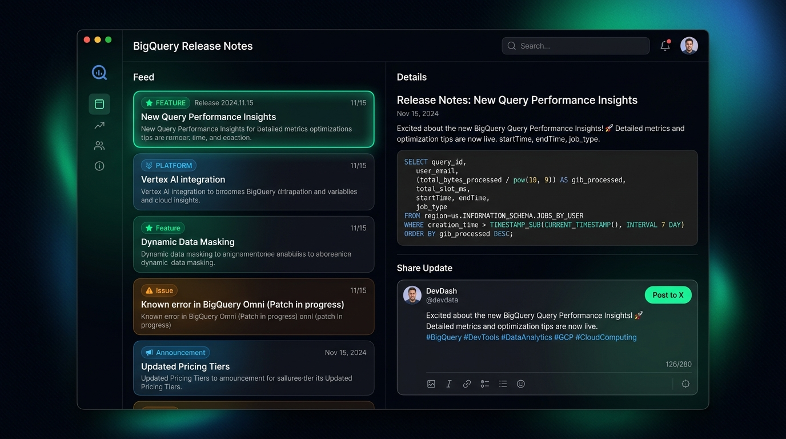
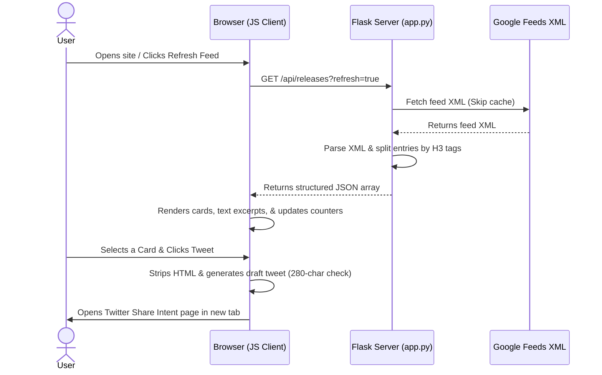

# BigQuery Release Notes Explorer 🚀

A premium developer dashboard built with **Python Flask**, **Vanilla HTML5**, **CSS3**, and **ES6 JavaScript** that fetches, parses, and formats the official Google Cloud BigQuery Release Notes feed. It allows developers to browse, search, filter updates, and immediately compose and share posts to X (Twitter).

## 🎨 Visual Interface Preview



---

## ⚡ Core Features

*   **Atom XML Parsing & Splitting**: Automatically resolves Google Cloud's Atom XML namespaces. Instead of displaying a single day's clustered feed blocks, it splits dates containing multiple sub-updates (e.g. Features mixed with Issues) into separate, individual cards with deep-anchored links.
*   **In-Memory Smart Cache**: Integrates a 5-minute memory caching layer on the Flask server to limit outbound requests. Triggers a live server bypass (`?refresh=true`) when clicking the manual Refresh button.
*   **No-Cache Dev Middleware**: Prevents local browser caching of index templates, scripts, and stylesheets, guaranteeing that updates display immediately upon reloads.
*   **Keyword Search & Tag Filtering**: Features client-side search filtering over dates, categories, and plain text alongside navigation buttons to isolate specific update types (Features, Announcements, Issues, Deprecated, and Changed).
*   **Interactive Twitter Composer**: Strips HTML tags safely via memory-based regular expressions (circumventing CSP/XSS blocks), generates custom tweet formats, validates length (280 characters max), and invokes Twitter's Web Intent composer.
*   **Rich Developer Aesthetics**: Designed with a dark obsidian palette featuring glassmorphism elements, custom scrollbars, animated skeleton loading placeholders, and responsive grids.

---

## 🛠️ Technology Stack

*   **Backend**: Python Flask 3.x
*   **Frontend Logic**: Vanilla JavaScript (ES6)
*   **Styling**: Vanilla CSS3
*   **Iconography**: Custom Inline SVGs
*   **Feed Parser**: Python standard `xml.etree.ElementTree` & `urllib.request` (zero heavy external parsing dependencies)

---

## 📂 Project Structure

```text
bq-releases-notes/
├── app.py                  # Flask entry point, Atom feed XML parsing, & caching
├── requirements.txt        # Flask dependency specification
├── README.md               # Repository documentation
├── mockup.jpg              # Dashboard UI interface mockup screenshot
├── .gitignore              # Git patterns file to ignore bytecodes, envs, & IDE configs
├── templates/
│   └── index.html          # Semantic HTML dashboard template
└── static/
    ├── css/
    │   └── styles.css      # Dark-mode styling, transitions, skeleton loaders, and responsive grids
    └── js/
        └── app.js          # Client-side state, filters, regex HTML stripper, and Twitter composer
```

---

## 🚀 Getting Started

### 1. Installation

Clone this repository and install the dependencies:
```bash
pip install -r requirements.txt
```

### 2. Run the Application

Navigate to the project root folder and launch the Flask server:
```bash
python app.py
```

Open your browser and visit:
```
http://127.0.0.1:5000
```

---

## 🔄 End-to-End Application Flow


